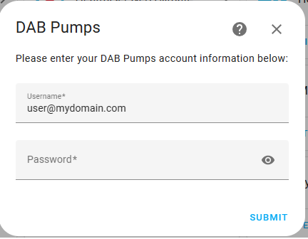

[](https://github.com/ankohanse/hass-dab-pumps)
[](https://github.com/ankohanse/hass-dab-pumps)
[](LICENSE)
[](https://github.com/custom-components/hacs)<br/>
[](https://www.buymeacoffee.com/ankohanse)


# Hass-DAB-Pumps

[Home Assistant](https://home-assistant.io/) custom component for retrieving sensor information from DAB Pumps devices.
This component uses webservices to connect to the DAB Pumps DConnect website and automatically determines which installations and devices are available there.

## Prerequisites
This device depends on the DAB Pumps DConnect website to retrieve the device information from. To see whether your pump device is supported, browse to [internetofpumps.com](https://internetofpumps.com/), select 'Professional Users' and scroll down to the operation diagram. Some pump devices will have integrated connectivity (Esybox MAX and Esybox Mini), others might require a DConnect Box/Box2 device (Esybox and Esybox Diver).

If you have a device that is supported for DConnect then:
- Enable your DAB Pumps devices to connect to DConnect. For more information on this, see the manual of your device.
- Setup an account for DConnect website, see 'DAB Pump Account' below. Remember the email address and password for the account as these are needed during setup of this Home Assistant integration.
- In DConnect, add your installation via the device serial number.

At the moment there is no support in the integration for devices that are connected to the DAB Live website instead of the DConnect website.


## DAB Pumps Account
The DAB Pumps DConnect website and apps seem to have a problem with multiple logins from the same account. I.e. when already logged into the app or website, then a subsequent login via this integration may fail. 

Therefore it is recommended to create a separate account within DAB Pumps DConnect that is specific for this HA integration. 
- Create a fresh email address specifically for Home Assistant at gmail, outlook or another provider. 
- Register this email address in the DAB Pumps DConnect website. Go to  [internetofpumps.com](https://internetofpumps.com/). Select 'Professional Users' and 'Open DConnect', or one of the apps. 
- Then, while logged in into DAB Pumps DConnect using your normal account, go to 'installation settings' and under 'manage permissions' press 'Add member' to invite the newly created email account. Access level 'Installer' is recommended to be able to use all features of the integration.


## Installation

### HACS

This custom integration is waiting to be included into the HACS default integrations.
Until that time, you can add it as a HACS custom repository:
1. In the HACS page, press the three dots at the top right corner.
2. Select 'Custom Repositories'
3. Enter repository "https://github.com/ankohanse/hass-dab-pumps" (with the quotes seems to work better)
4. select category 'integration' and press 'Add'
2. Restart Home Assistant.
3. Follow the UI based [Configuration](#Configuration)


### Manual install

1. Under the `<config directory>/custom_components/` directory create a directory called `dabpumps`. 
Copying all files in `/custom_components/dabpumps/` folder from this repo into the new `<config directory>/custom_components/dabpumps/` directory you just created.

    This is how your custom_components directory should look like:

    ```bash
    custom_components
    ├── dabpumps
    │   ├── translations
    │   │   └── en.json
    │   ├── __init__.py
    │   ├── api.py
    │   ├── binary_sensor.py
    │   ├── config_flow.py
    │   ├── const.py
    │   ├── coordinator.py
    │   ├── diagnostics.py
    │   ├── entity_base.py
    │   ├── manifest.json
    │   ├── number.py
    │   ├── select.py
    │   ├── sensor.py
    │   ├── strings.json
    │   └── switch.py  
    ```

2. Restart Home Assistant.
3. Follow the UI based [Configuration](#Configuration)

## Configuration

The custom component was tested with a ESybox 1.5kw combined with a DConnect Box 2. 
It has also been reported to function correctly for ESybox Mini and ESybox Diver.

To start the setup of this custom integration:
- go to Home Assistant's Integration Dashboard
- Add Integration
- Search for 'DAB Pumps'
- Follow the prompts in the configuration step

### Step 1 - Connection details
The following properties are required to connect to the DConnect service:
- Username: email address as registered for the DConnect service
- Password: password associated with the username
  



### Installations and devices
After succcessful setup, all devices from the installation in DConnect should show up in a list.


On the individual device pages, the hardware related device information is displayed, together with sensors typically grouped into main entity sensors and diagnostics.

Any sensors that you do not need can be manually disabled using the HASS GUI.


### Sensors
Sensors are registered to each device as `sensor.{device_name}_{sensor_name}` with an easy to read friendly name of `sensor_name`. 
  


## Troubleshooting
Please set your logging for the this custom component to debug during initial setup phase. If everything works well, you are safe to remove the debug logging:

```yaml
logger:
  default: warn
  logs:
    custom_components.dabpumps: info
```


## Credits

Special thanks to the following people for their testing and feedback on the first versions of this custom integration:
- [Djavdeteg](https://github.com/Djavdeteg) on ESybox Mini 3
- [Coldness00](https://github.com/Coldness00) on ESybox Mini 3
- [benjaminmurray](https://github.com/benjaminmurray) on ESybox Mini 3
- [nicopret1](https://github.com/nicopret1) on ESybox Mini 3
- [Bascht74](https://github.com/Bascht74) on ESybox Diver (with fluid add-on)


