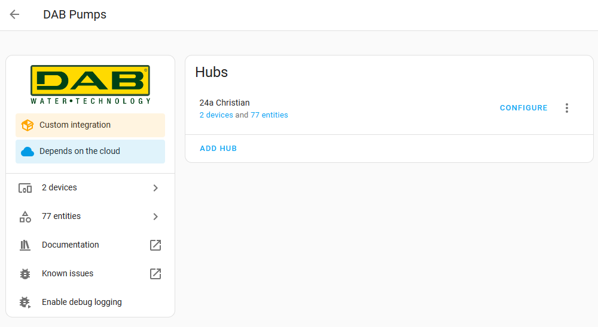
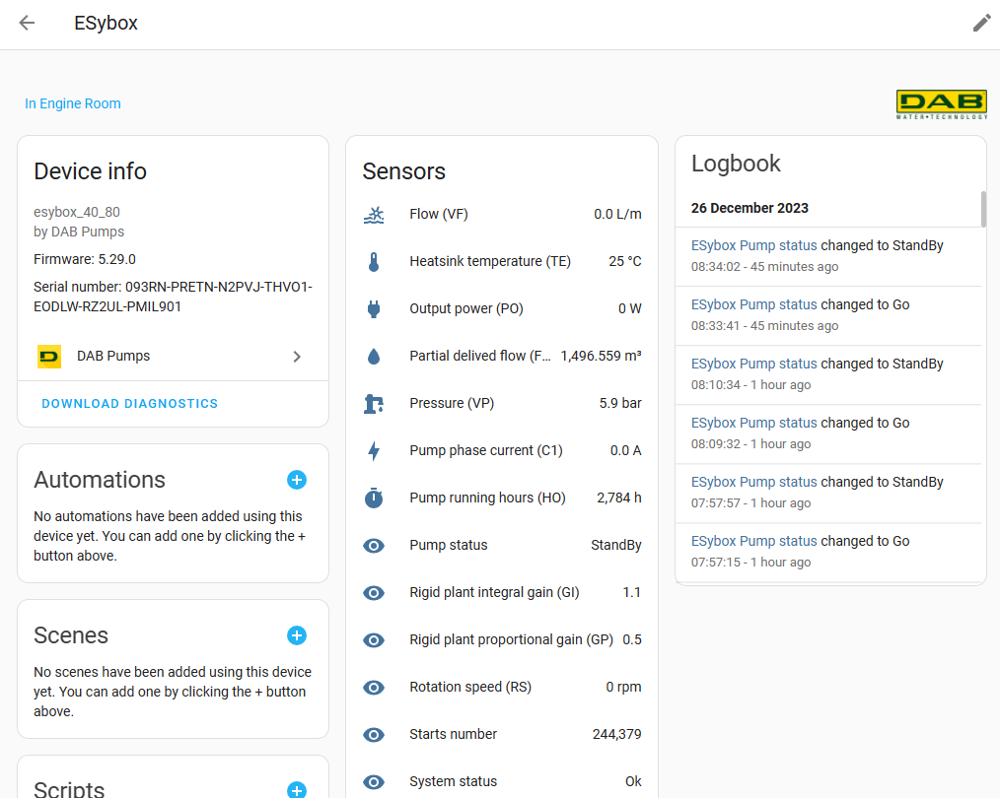

[](https://github.com/ankohanse/hass-dab-pumps)
[](https://github.com/ankohanse/hass-dab-pumps)
[](LICENSE)
[](https://github.com/custom-components/hacs)<br/>
[](https://www.buymeacoffee.com/ankohanse)


# Hass-DAB-Pumps

[Home Assistant](https://home-assistant.io/) custom component for retrieving sensor information from DAB Pumps devices.
This component uses webservices to connect to the DAB Pumps DConnect website and automatically determines which installations and devices are available there.

## Prerequisites
This device depends on the DAB Pumps DConnect website to retrieve the device information from. To see whether your pump device is supported, browse to [internetofpumps.com](https://internetofpumps.com/), select 'Professional Users' and scroll down to the operation diagram. Some pump devices will have integrated connectivity (Esybox MAX and Esybox Mini), others might require a DConnect Box/Box2 device (Esybox and Esybox Diver).

If you have a device that is supported for DConnect then:
- Enable your DAB Pumps devices to connect to DConnect. For more information on this, see the manual of your device.
- Setup an account on the DConnect website [internetofpumps.com](https://internetofpumps.com/). Select 'Professional Users' and 'Open DConnect', or one of the apps. Remember the email address and password for the account as these are needed during setup of this Home Assistant integration.
- In DConnect, add your installation via the device serial number.

At the moment there is no support in the integration for devices that are connected to the DAB Live website instead of the DConnect website.


## Installation

### HACS

1. Just search for "DAB Pumps" integration in HACS. It will be automatically installed to the `custom_integration/dabpumps` directory
2. Restart Home Assistant.
3. In the HA UI go to "Configuration" -> "Integrations" click "+" and search for "DAB Pumps"
4. Follow the UI based [Configuration](#Configuration)


### Manual install

Under the `<config directory>/custom_components/` directory create a directory called `dabpumps`. 
Copying all files in `/custom_components/dabpumps/` folder from this repo into the new `<config directory>/custom_components/dabpumps/` directory you just created.

This is how your custom_components directory should look like:

```bash
custom_components
├── dabpumps
├────── translations
│   ├───└── en.json
│   ├── __init__.py
│   ├── config_flow.py
│   ├── const.py
│   ├── coordinator.py
│   ├── dabpumpsapi.py
│   ├── manifest.json
│   ├── sensor.py
│   └── strings.json  
```

Finally, restart Home Assistant

## Configuration

The custom component was tested with a ESybox 1.5kw with firmware v5.29.0 combines with a DConnect Box 2 with firmware 7.03. 
I expect it should also work for an ESybox Mini and probably also for other devices.

To start the setup of this custom integration:
- go to Home Assistant's Integration Dashboard
- Add Integration
- Search for 'DAB Pumps'
- Follow the prompts in the configuration step

### Step 1 - Connection details
The following properties are required to connect to the DConnect service:
- Username: email address as registered for the DConnect service
- Password: password associated with the username
  


### Installations and devices
After succcessful setup, all devices from known installations in DConnect should show up in a list.



On the individual device pages, the hardware related device information is displayed, together with sensors typically grouped into main entity sensors and diagnostics.

Any sensors that you do not need can be manually disabled using the HASS GUI.



### Sensors
Sensors are registered to each device as `sensor.{device_name}_{sensor_name}` with an easy to read friendly name of `sensor_name`. 
  


## Troubleshooting
Please set your logging for the this custom component to debug during initial setup phase. If everything works well, you are safe to remove the debug logging:

```yaml
logger:
  default: warn
  logs:
    custom_components.dabpumps: info
```


## Credits

Thank you for giving a great example of how to create a custom controller: [dm82m](https://github.com/dm82m) and [evercape](https://github.com/evercape)

